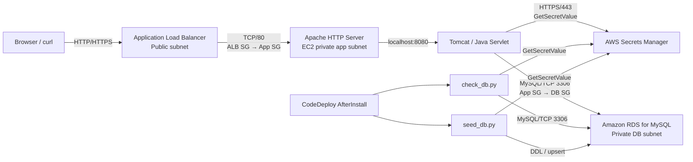
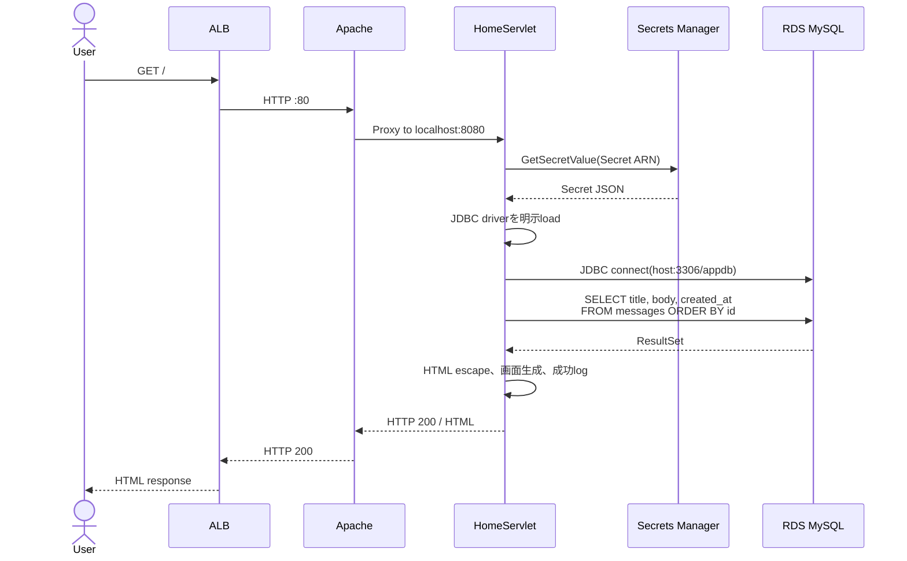
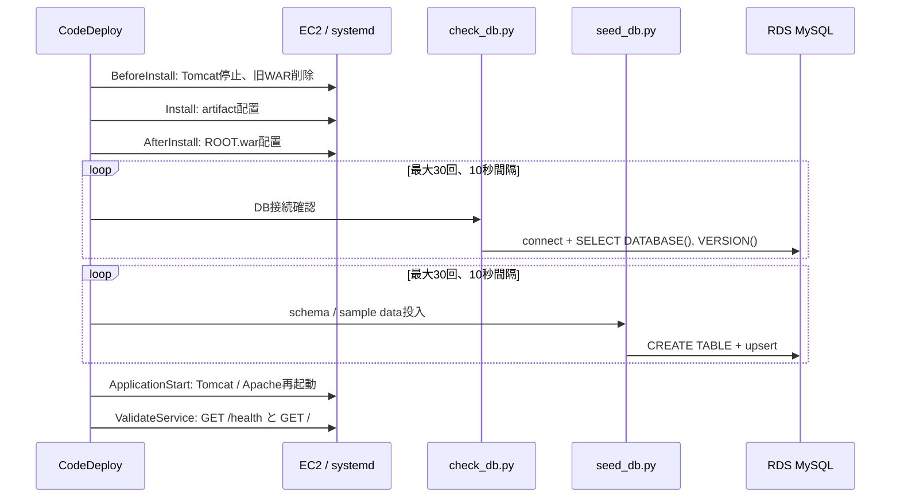

# AP–DB 接続・データ処理 詳細設計書

## 1. 文書の目的

本書は、AWS Learning Web におけるAP層（Apache HTTP Server / Tomcat / Java Servlet）とDB層（Amazon RDS for MySQL）の接続方式、認証情報の管理、Web画面の参照処理、デプロイ時のDB疎通確認・初期データ投入、監視および障害時の挙動を説明するものです。

対象は現在の学習環境の実装です。本番環境で追加すべき対策は「12. 本番化に向けた改善事項」に分けて記載します。

## 2. 対象範囲

| 区分 | 対象 |
| --- | --- |
| AP入口 | Internet-facing ALB、Apache HTTP Server |
| AP処理 | Tomcat 10、Java 17 Servlet |
| DB | Amazon RDS for MySQL、`appdb` database |
| 認証情報 | AWS Secrets Manager、EC2 IAM Role |
| 初期化処理 | `check_db.py`、`seed_db.py`、CodeDeploy AfterInstall hook |
| 運用 | Systems Manager Session Manager、CloudWatch Logs / Metrics / Alarms |

ユーザー登録や更新API、業務トランザクション、DB migration framework、Secret自動rotationは現行実装の対象外です。

## 3. 構成概要



APサーバーとRDSは同一VPC内に配置されます。RDSはpublic accessを無効化し、Internet GatewayやNAT Gatewayを経由せず、VPCのlocal routeを使ってprivate IPへ接続します。DB subnet用route tableにはdefault internet routeを設定していません。

Secrets Manager APIへの通信は、現在の設定ではprivate App subnetからNAT Gatewayを経由してHTTPS/443でAWS APIへ到達します。`enable_vpc_endpoints=true` の場合は、Private DNSを有効にしたSecrets Manager interface VPC endpointを利用できます。

## 4. コンポーネントと責務

| コンポーネント | 責務 |
| --- | --- |
| ALB | 外部リクエストの受け付け、EC2への振り分け、`/health` によるtarget health確認 |
| Apache | ポート80で受信し、`/health` を静的応答。それ以外をlocalhostのTomcat:8080へreverse proxy |
| Tomcat | `ROOT.war` を実行し、Servletへリクエストを渡す |
| `HomeServlet` | Secret取得、MySQL接続、`messages` 参照、HTML生成、アプリログ出力 |
| Secrets Manager | RDS接続先、database名、username、passwordをJSONで保管 |
| EC2 IAM Role | 対象Secret ARNに限って `secretsmanager:GetSecretValue` を許可 |
| RDS MySQL | `appdb.messages` の永続化と検索 |
| `check_db.py` | Secretを取得し、接続先databaseとMySQL versionを確認 |
| `seed_db.py` | tableを作成し、サンプル2件を冪等に登録・更新 |
| CodeDeploy | WARとPython scriptを配置し、DB確認・初期化・サービス再起動・検証を順次実行 |

## 5. ネットワーク接続設計

### 5.1 通信経路

| From | To | Protocol / Port | 制御 | 用途 |
| --- | --- | --- | --- | --- |
| Internet | ALB | TCP/80、証明書設定時TCP/443 | ALB Security Group | Webアクセス |
| ALB | EC2 Apache | TCP/80 | ALB SGをsourceとするApp SG ingress | 通常のWeb通信とhealth check |
| ALB | EC2 Tomcat | TCP/8080 | ALB SGをsourceとするApp SG ingress | 診断用として許可。通常経路はApache経由 |
| Apache | Tomcat | TCP/8080、loopback | EC2内部 | reverse proxy |
| EC2 | RDS MySQL | TCP/3306 | App SGのegressとDB SGのingressをSG参照で限定 | SQL通信 |
| EC2 | Secrets Manager | HTTPS/443 | App SG egress、IAM authorization | Secret取得 |

DB SGはCIDRによる広い許可ではなく、App SGをsourceに指定します。そのため、同じVPC内でもApp SGを持たないresourceからRDSへは接続できません。SSH/TCP 22のingressは作成せず、運用接続にはSession Managerを使用します。

Security Groupはstatefulであるため、許可されたconnectionに対する戻りtrafficは自動的に許可されます。Network ACLは明示的に追加しておらず、VPC defaultの許可設定を利用します。

### 5.2 名前解決

VPCではDNS supportとDNS hostnamesを有効化しています。アプリはSecrets Managerに格納されたRDS endpointのFQDNを名前解決し、RDSのprivate IPへ接続します。RDS failoverやinstance replacementを考慮し、IP addressをコードや設定へ固定しません。

### 5.3 `/health` の独立性

Apacheは `/health` に対して静的ファイル `OK` を返し、TomcatやRDSを経由しません。この設計により、一時的なDB障害だけでALB targetを直ちに切り離すことを避けています。

一方、`/health` が200でもDB接続やTomcatの業務処理が正常とは限りません。CodeDeployのValidateServiceでは `/health` に加えて `/` も確認します。ただし現行の `/` はDB接続失敗時もエラー内容を画面内に表示しHTTP 200を返すため、DB正常性を厳密に保証するhealth checkではありません。

### 5.4 RDSの主要設定

| 項目 | 現行値・方針 |
| --- | --- |
| Engine | MySQL。version未指定時はprovider/APIが選択する既定version |
| Instance class | `db.t4g.micro` |
| Storage | gp3、20 GiB、storage encryption有効、最大40 GiBまでautoscaling |
| Database | `appdb` |
| Port | 3306 |
| Public access | 無効 |
| Subnet Group | 2つのprivate DB subnet |
| Availability | Single-AZが既定。`rds_multi_az=true` でMulti-AZ化 |
| Backup retention | 1日 |
| Log export | error、slow query |
| Deletion | 学習環境ではdeletion protection無効、final snapshot省略 |

## 6. 認証情報・権限設計

### 6.1 Secretの生成と格納

Terraformのdatabase moduleが32文字のrandom passwordを生成し、RDS master passwordとSecrets ManagerのSecret valueへ同じ値を設定します。Secret名は次の形式です。

```text
aws-learning-web/database_20260902
```

Secret valueの論理schemaは次のとおりです。以下は形式例であり、実値をrepositoryやログへ記録してはいけません。

```json
{
  "engine": "mysql",
  "host": "<RDS endpoint>",
  "port": 3306,
  "dbname": "appdb",
  "username": "<database user>",
  "password": "<random password>"
}
```

Terraform stateには生成したpasswordとSecret valueが保存されるため、state bucketとそのIAM権限もSecretと同等の機密情報として扱います。

### 6.2 EC2への設定受け渡し

Launch TemplateのUser DataはSecretの「値」ではなくSecret ARNだけを `/etc/aws-learning-web.env` に設定します。

```text
AWS_REGION=<region>
DB_SECRET_ARN=<secret ARN>
APP_VERSION=<version>
CATALINA_OPTS="-Daws.region=... -Ddb.secret.arn=... -Dapp.version=..."
```

ファイルはowner `root`、group `tomcat`、mode `0640` です。Tomcatはsystemdの `EnvironmentFile` と `CATALINA_OPTS` を通じてregion、Secret ARN、application versionを受け取ります。Python scriptはCodeDeploy hookが同じファイルを読み込み、`AWS_REGION` と `DB_SECRET_ARN` をexportして使用します。

### 6.3 AWS認証

アプリにAccess KeyやSecret Access Keyを配置しません。EC2 Instance ProfileのIAM Roleから一時credentialを取得し、AWS SDK for Javaまたはboto3のdefault credential provider chainでSecrets Managerを呼び出します。

EC2 Roleのapplication policyは、Terraformから渡された対象Secret ARNに対する次のactionだけを許可します。

```text
secretsmanager:GetSecretValue
```

Secretを取得するAWS API通信のauthorizationと、取得後にMySQLへ接続するdatabase authenticationは別の処理です。

1. IAM RoleでSecrets Manager APIを認証・認可する。
2. Secret JSONからusername/passwordを取得する。
3. username/passwordでRDS MySQLへdatabase認証する。

## 7. Web参照処理

### 7.1 対象URL

`HomeServlet` はcontext rootと `/app` にmappingされています。`/styles.css` などのstatic resourceはDefaultServletに処理させます。

### 7.2 処理sequence



### 7.3 詳細処理

1. Servletはリクエストごとに空のmessage listと初期status `Not checked` を作成します。
2. Java system property `db.secret.arn` を優先し、未設定時はenvironment variable `DB_SECRET_ARN` を参照します。
3. `aws.region` を優先し、未設定時は `AWS_REGION`、それもなければ `ap-northeast-1` を使用します。
4. AWS SDK for Javaで `GetSecretValue` を実行し、Secret stringをJSONとしてparseします。
5. `host`、`port`、`dbname` からJDBC URLを組み立てます。
6. `Class.forName("com.mysql.cj.jdbc.Driver")` でMySQL JDBC driverを明示的にloadします。
7. Secretのusername/passwordでMySQL connectionを確立します。
8. 固定SQLで `messages` tableの全行をID昇順に取得します。
9. title、body、created_atをHTML escapeして画面へ出力します。
10. connection、statement、result setはtry-with-resourcesでcloseします。

現在のJDBC URLは次の形式です。

```text
jdbc:mysql://<host>:<port>/<dbname>?useSSL=true&requireSSL=false&serverTimezone=UTC
```

`requireSSL=false` のためTLS接続を必須化していません。さらにserver CA certificateの明示検証設定もありません。本番環境ではRDS側のsecure transport強制と、client側のTLS必須・certificate検証を組み合わせます。

### 7.4 DB接続失敗時

Secret取得、JSON parse、JDBC driver load、DNS、network、database authentication、SQL実行のいずれかで例外が発生した場合、Servletは例外class名だけを画面へ表示します。

```text
Connection failed: <ExceptionClass>
```

stack traceはTomcat logへ、簡略化したeventは `/var/log/aws-learning-web/app.log` へ出力します。passwordやSecret JSONは出力しません。ページ自体はHTTP 200で返し、message欄は空になります。

## 8. DB疎通確認処理

`check_db.py` はデプロイ時またはSession Managerでの手動確認に使います。

### 8.1 入力

| 項目 | 取得元 | 既定値 |
| --- | --- | --- |
| Secret ARN | `--secret-arn` または `DB_SECRET_ARN` | なし。未設定時は終了 |
| Region | `--region` または `AWS_REGION` | `ap-northeast-1` |

### 8.2 処理

1. boto3でSecret valueを取得してJSON parseする。
2. PyMySQLでRDSへ接続する。connection timeoutは10秒。
3. `SELECT DATABASE(), VERSION()` を実行する。
4. database名とMySQL versionだけを標準出力へ表示する。
5. context managerによりconnectionとcursorをcloseする。

正常出力例は次のとおりです。credential、host、Secret valueは表示しません。

```text
DB connection OK: database=appdb, mysql_version=<version>
```

## 9. 初期データ投入処理

`seed_db.py` はschema作成と学習用sample dataの投入を担当します。

### 9.1 Table定義

```sql
CREATE TABLE IF NOT EXISTS messages (
  id INT AUTO_INCREMENT PRIMARY KEY,
  title VARCHAR(255) NOT NULL UNIQUE,
  body TEXT NOT NULL,
  created_at TIMESTAMP DEFAULT CURRENT_TIMESTAMP
);
```

| Column | Type | 制約・用途 |
| --- | --- | --- |
| `id` | `INT` | Primary Key、Auto Increment、表示順 |
| `title` | `VARCHAR(255)` | NOT NULL、UNIQUE、seed処理の冪等key |
| `body` | `TEXT` | NOT NULL、message本文 |
| `created_at` | `TIMESTAMP` | insert時にcurrent timestampを設定 |

### 9.2 Upsert

サンプル2件をparameterized queryで一括実行します。

```sql
INSERT INTO messages (title, body)
VALUES (%s, %s)
ON DUPLICATE KEY UPDATE body = VALUES(body);
```

`title` のUNIQUE制約を利用し、初回はinsert、同じtitleが存在する場合はbodyだけをupdateします。このため、CodeDeployを複数回実行しても同一titleのrecordが増殖しません。既存recordをupdateしても `created_at` は変更しません。

PyMySQL connectionは`autocommit=True`です。各statementは自動commitされます。現行のseedは小規模な初期データ向けであり、version管理されたschema migrationを代替するものではありません。

## 10. CodeDeployとの連携



AfterInstall hookはRDS作成直後や一時的なnetwork遅延を考慮し、`check_db.py` と `seed_db.py` をそれぞれ最大30回、10秒間隔でretryします。成功した時点で次へ進み、全retry失敗時はexit code 1を返してdeploymentを失敗させます。AppSpec上のAfterInstall timeoutは600秒です。各connection attempt自体にも最大10秒かかるため、長時間のtimeoutが続く場合はscript内の30回より先にCodeDeploy側の600秒制限へ達する可能性があります。

処理順は「DB接続確認 → schema/sample data投入 → Tomcat/Apache起動」です。これにより、DBへ到達できないrevisionを正常deploymentとして扱いません。AfterInstallが失敗すると後続のApplicationStartとValidateServiceはskipされます。Deployment Groupではdeployment failure時の自動rollbackを有効にしています。

## 11. ログ・監視・障害切り分け

### 11.1 主なログ

| 事象 | Local log | CloudWatch Logs |
| --- | --- | --- |
| ServletのDB接続成否 | `/var/log/aws-learning-web/app.log` | `/aws/ec2/aws-learning-web/application_20260902` |
| Java exception / Tomcat起動 | `/opt/tomcat/logs/catalina.out` | `/aws/ec2/aws-learning-web/tomcat_20260902` |
| Apache proxy / HTTP error | `/var/log/httpd/error_log` | `/aws/ec2/aws-learning-web/apache-error_20260902` |
| CodeDeploy hook | CodeDeploy agent deployment log | `/aws/ec2/aws-learning-web/codedeploy_20260902` |
| RDS error / slow query | RDS exported logs | RDS log export |

Application logには成功時のrow count、失敗時の例外class名を記録します。CloudWatch metric filterは `ERROR`、`Exception`、`OutOfMemory`、`Failed` を検出します。RDSではCPU、free storage、freeable memory、connection数、read/write latencyをalarm対象にしています。

### 11.2 安全な確認command

Secretの値を出力せず、metadataと接続結果だけを確認します。

```bash
aws secretsmanager describe-secret \
  --secret-id 'aws-learning-web/database_20260902' \
  --region ap-northeast-1

aws rds describe-db-instances \
  --db-instance-identifier aws-learning-web-rds-20260902 \
  --region ap-northeast-1 \
  --query 'DBInstances[0].{Status:DBInstanceStatus,Engine:Engine,Endpoint:Endpoint.Address,Port:Endpoint.Port,Public:PubliclyAccessible}'
```

Session ManagerでEC2へ接続した後は、環境file全体やSecret valueを表示せず、用意済みscriptを実行します。

```bash
sudo bash -lc 'set -a; source /etc/aws-learning-web.env; set +a; python3 /opt/aws-learning-web/scripts/check_db.py'
sudo bash -lc 'set -a; source /etc/aws-learning-web.env; set +a; python3 /opt/aws-learning-web/scripts/seed_db.py'
```

### 11.3 障害の切り分け順序

| 症状 | 主な確認点 |
| --- | --- |
| `GetSecretValue` AccessDenied | EC2 Instance Profile、対象Secret ARN、`secretsmanager:GetSecretValue`、KMS key policy（CMK利用時） |
| Secret取得timeout | App subnetのNAT routeまたはSecrets Manager VPC endpoint、DNS、App SGの443 egress |
| MySQL接続timeout | RDS status、endpoint DNS、App SG→DB SGの3306、DB subnet/route/NACL |
| Access denied for database user | SecretとRDS passwordの不整合、username、database権限 |
| Unknown database/table | `dbname`、AfterInstall / `seed_db.py` の実行結果 |
| `No suitable driver` | WAR内のMySQL Connector/J、driverの明示load、Maven build結果 |
| 画面は200だがDB failed | `/health` がDB非依存であることを考慮し、Tomcat/application logと`check_db.py`を確認 |
| CodeDeploy AfterInstall失敗 | lifecycle diagnosticsのlog tail、RDS ready状態、retry回数とtimeout |

## 12. 本番化に向けた改善事項

| 現行 | 本番向け改善 |
| --- | --- |
| Web requestごとにSecretを取得 | AWS Secrets Manager client-side caching library等で短時間cacheし、API latencyとcostを削減 |
| Web requestごとにDB connectionを作成 | HikariCP等のconnection pool、最大connection数、validation、timeoutを設計 |
| JavaはTLSを必須化していない | `sslMode=VERIFY_IDENTITY` 相当、RDS CA bundle、RDS側secure transport強制を採用 |
| PythonはTLS option未指定 | PyMySQLへCA certificateとTLS必須設定を追加 |
| RDS master userをapplicationが使用 | application専用の最小権限userとmigration専用userを分離 |
| Secret rotationなし | Secrets Manager rotationまたはRDS managed master passwordを採用し、cache更新も設計 |
| `Statement` と全件取得 | `PreparedStatement`、pagination、query timeout、read limitを設定 |
| DB失敗でもWebはHTTP 200 | readiness endpointを分離し、依存serviceの状態を監視。ただしALB切離し条件は可用性要件に合わせる |
| `seed_db.py` でDDL管理 | Flyway/Liquibase等でversion付きmigration、rollback方針、互換性を管理 |
| Retry回数に対してAfterInstall timeoutが短くなり得る | 1回の接続timeoutを含めてretry budgetを算出し、hook timeoutとの整合を取る |
| RDS Single-AZ、backup 1日 | Multi-AZ、backup期間延長、deletion protection、final snapshot、復元test |
| master passwordがTerraform stateに保存 | state権限の厳格化、CMK、RDS managed password等で露出範囲を縮小 |
| desired capacity 1 | 複数instance、rolling/blue-green deployment、connection drainingを設計 |

## 13. 実装との対応表

| 設計項目 | 実装file |
| --- | --- |
| ServletのSecret取得・SQL・画面表示 | `app/tomcat-app/src/main/java/com/example/learning/HomeServlet.java` |
| Java dependencies | `app/tomcat-app/pom.xml` |
| DB疎通確認 | `app/scripts/check_db.py` |
| Table作成・seed | `app/scripts/seed_db.py` |
| DB処理のretry | `app/deploy/scripts/after_install.sh` |
| Deployment lifecycle | `app/deploy/appspec.yml` |
| EC2環境変数・Apache proxy | `user_data/al2023_setup.sh` |
| EC2 IAM Role | `infra/modules/compute/main.tf` |
| RDS・Secret | `infra/modules/database/main.tf` |
| App/DB Security Group | `infra/modules/security/main.tf` |
| subnet・route・VPC endpoint | `infra/modules/network/main.tf` |
| RDS監視 | `infra/modules/monitoring/main.tf` |

## 14. 設計上の要点

- APとDBのdata通信は同一VPC内のprivate経路で行い、RDSはinternetへ公開しません。
- network authorizationはSecurity Group参照、Secret取得はIAM、database loginはMySQL credentialという3層で制御します。
- passwordはsource code、Git repository、User Dataへ埋め込まず、実行時にSecrets Managerから取得します。
- 初期データ処理はtitleのUNIQUE制約とupsertで冪等にしています。
- DB障害時もApacheの `/health` は応答するため、ALB healthとDB/application healthを区別して運用します。
- 現行構成は学習用として動作を明示し、本番化ではTLS強制、connection pooling、Secret cache、最小権限DB user、migration管理を優先します。
