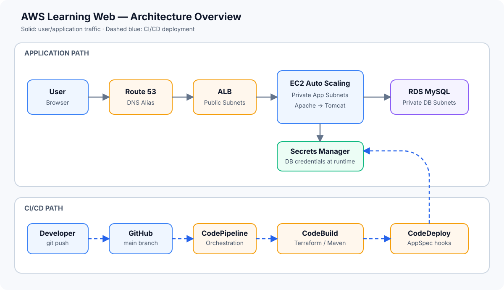

# AWS Learning Web

TerraformとAWS Developer Toolsを使い、**設計・構築・自動デプロイ・障害対応・動作確認・削除**まで一貫して実施した、AWSインフラ構築ポートフォリオです。

> 検証は完了しています。継続課金を避けるためAWSリソースは削除済みですが、Terraformコード、アプリケーション、設計書、運用手順をこのリポジトリで公開しています。

## Project at a Glance

| 項目 | 内容 |
| --- | --- |
| 目的 | 商用環境を意識した3層WebシステムとCI/CDの構築 |
| IaC | Terraformによるネットワーク、コンピュート、DB、監視、運用基盤のコード化 |
| CI/CD | GitHubへのpushを起点に、plan・apply・build・deployを自動実行 |
| Web | Route 53 → ALB → Apache → Tomcat / Java Servlet |
| Database | Private RDS MySQL、Secrets Manager、IAM Roleによる認証情報取得 |
| Operations | CloudWatch、SNS、SSM Session Manager、Patch Manager |
| Security | EC2/RDSのprivate配置、SSH非開放、RDS非公開、暗号化、Secret分離 |
| 検証結果 | HTTP 200、DB接続、初期データ表示、CodeDeploy成功、destroy完了 |

## Architecture



利用者の通信とデプロイ経路を分離しています。WebリクエストはALBからprivate subnetのEC2へ転送し、TomcatはIAM RoleでSecrets Managerから接続情報を取得してprivate RDSへ接続します。開発者のpushはCodePipelineを起点にTerraformとアプリケーションのデプロイへ連携します。

[構成と通信経路の詳細を見る](./architecture.md) / [AP–DB接続・Secret・SQL処理の詳細を見る](./application-database-design.md)

## What I Built

- VPC、Public/App/DB subnet、Security Groupによるネットワーク分離
- ALB、EC2 Auto Scaling、Apache、TomcatによるWeb/AP基盤
- RDS MySQLとSecrets ManagerによるDB・認証情報管理
- Route 53による独自ドメイン公開と、ACM証明書を指定できるHTTPS設計
- CodePipeline、CodeBuild、CodeDeploy、GitHub CodeConnectionsによるCI/CD
- CloudWatch Logs/Alarms、SNS、SSM Session Manager/Patch Managerによる運用基盤
- S3 remote stateとlockingを利用したTerraform実行基盤

## Delivery Pipeline

```text
GitHub main push
  → Source (CodeConnections)
  → Terraform validate / plan
  → Terraform apply
  → ASG・ALB・SSM readiness check
  → Maven build / deployment package
  → CodeDeploy hooks
  → Apache・Tomcat・RDS connection validation
```

インフラ変更とアプリケーション配布を1本のパイプラインで実行し、デプロイ前後にインフラの準備状態、DB接続、HTTP応答を確認します。

## Verified Results

| 確認項目 | 結果 |
| --- | --- |
| Route 53 → ALB → EC2/Apache/Tomcat | `200 OK` |
| ALB health endpoint | `200 OK` |
| Tomcat → Secrets Manager | Secret取得成功 |
| Tomcat → RDS MySQL | 接続成功・データ表示成功 |
| CodeDeploy | 全lifecycle hook成功 |
| Session Manager | SSHを使わず接続成功 |
| DB seed | 冪等実行後も2レコードを維持 |
| リソース削除 | `infra` → `bootstrap`の順でdestroy完了 |

## Troubleshooting Highlights

単に正常系を構築するだけでなく、各サービスのログと実行履歴から原因を切り分け、コードへ再発防止策を反映しました。

| 事象 | 原因 | 解決・再発防止 |
| --- | --- | --- |
| Source stageが失敗 | GitHub Appのrepository access不足 | 対象repositoryを許可し、Connection状態とIAM権限も確認 |
| Terraform planがlock解除で失敗 | CodeBuild RoleのS3削除権限不足 | state lock objectに限定して`DeleteObject`を追加 |
| JavaアプリからDB接続不可 | JDBC Driverが自動認識されなかった | Driverを明示的にloadするようアプリを修正 |
| CSSへアクセスするとHTMLが返る | Servletのroot mappingが静的ファイルも処理 | mappingを修正しTomcat default servletへ委譲 |
| CodeDeploy AfterInstallが失敗 | RDS接続準備中の一時的なtimeout | DB確認・seed処理へretryを実装 |

[全トラブルシュート記録を見る](./portfolio-case-study.md#トラブルシュート記録)

## Design Decisions

- `/health`はApacheが静的に返し、DB一時障害だけでALBがEC2を切り離さない設計
- DB Security GroupはApp Security Groupからの3306/TCPのみ許可
- PasswordはコードやUser Dataへ保存せず、実行時にSecrets Managerから取得
- EC2へSSH ingressを設けず、IAMで制御できるSession Managerを採用
- DB初期データ投入は再実行しても重複しない冪等処理として実装
- 構築だけでなく、依存関係を考慮した削除手順まで運用資料へ記載

## Production Readiness

この構成は学習・検証環境です。本番化する場合は、HTTPS必須化、Multi-AZ RDS/NAT、Secret rotation、WAF、ALB access logs、VPC Flow Logs、バックアップ、IAM権限の細分化、Blue/Green deploymentなどを追加します。また、学習要件で使用したCIDRは、本番ではRFC 1918のprivate addressへ変更します。

## Documents

| ドキュメント | 内容 |
| --- | --- |
| [Portfolio Case Study](./portfolio-case-study.md) | プロジェクトの目的、成果、CI/CD、課題解決、学び |
| [Architecture](./architecture.md) | ネットワーク、通信経路、監視、パッチ、セキュリティ |
| [Application and Database Design](./application-database-design.md) | AP–DB接続、Secret取得、SQL、初期データ、障害時の動作 |
| [Web Application Replacement Guide](./web-application-replacement-guide.md) | 教材HTML・CSS・JavaScript・WARの差し替え、検証、デプロイ、rollback |
| [Multi Web App Routing Guide](./multi-web-app-routing-guide.md) | 1つのTomcat/WARで複数WebアプリをURLパスごとに動かす方法 |
| [RunRoute Japan Web App](./running-route-map-app.md) | ランニングコース地図アプリの機能、API構成、HTTPS要件、デプロイ手順 |
| [Operations](./operations.md) | 構築後確認、監視、デプロイ、障害調査、削除 |
| [Publish Checklist](./publish-checklist.md) | 機密情報や公開設定の確認項目 |

## What This Project Demonstrates

AWSサービスを個別に作成するだけでなく、IaC、CI/CD、アプリケーション、DB、監視、運用をつなぎ、失敗時にCodePipeline、CodeBuild、CodeDeploy、OS/アプリログを横断して原因を追えることを示しています。

[GitHubリポジトリを見る](https://github.com/deutch6122/aws-learning-web-20260902)
