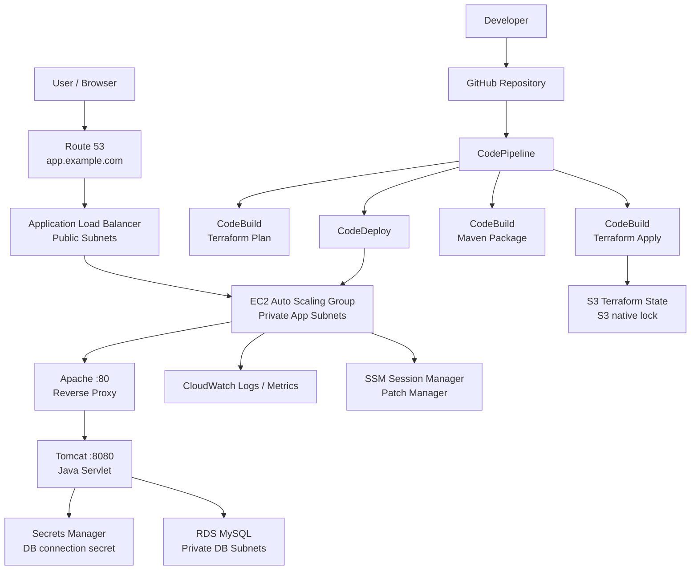

# Portfolio Case Study: AWS Learning Web

## 概要

Terraform と AWS Developer Tools を使い、AWS 上に商用環境を模した Web アプリケーション基盤を構築しました。GitHub への push を起点に、Terraform によるインフラ更新、CodeBuild によるアプリケーション build、CodeDeploy による EC2/Tomcat への配布までを自動化しています。

このプロジェクトは、単にリソースを作成するだけでなく、構築、CI/CD、動作確認、障害切り分け、削除までを一貫して再現できることを目的にしています。

## 成果

- GitHub 連携の CodePipeline による CI/CD を構築
- Terraform で VPC、ALB、Auto Scaling、RDS、Secrets Manager、Route 53、CloudWatch、SSM を管理
- Apache + Tomcat + Java Servlet アプリを EC2 に CodeDeploy で配布
- RDS MySQL への接続情報を Secrets Manager に保存し、アプリ実行時に IAM Role で取得
- Session Manager による SSH なしの運用確認を実施
- Route 53 の独自ドメイン経由で Web アプリへアクセス
- `terraform destroy` により課金対象リソースの削除まで確認

## 使用技術

- AWS: VPC, EC2, Auto Scaling, ALB, RDS MySQL, Secrets Manager, Route 53, CloudWatch, SSM, CodePipeline, CodeBuild, CodeDeploy, S3, DynamoDB, IAM
- IaC: Terraform
- CI/CD: AWS CodePipeline, CodeBuild, CodeDeploy, GitHub CodeConnections
- Application: Java 17, Tomcat 10, Apache HTTP Server, MySQL Connector/J
- Operations: Session Manager, CloudWatch Logs, CloudWatch Alarms, SSM Patch Manager

## アーキテクチャ



## CI/CD フロー

1. GitHub の `main` branch に push
2. CodeConnections Source action が repository から source artifact を取得
3. CodeBuild が `terraform fmt`, `validate`, `plan` を実行
4. CodeBuild が `terraform apply` を実行
5. CodeBuild が ASG, ALB target health, SSM online を確認
6. CodeBuild が Java/Tomcat アプリを Maven で WAR package 化
7. CodeDeploy が EC2 に artifact を配置
8. AppSpec hook で Tomcat 配置、DB 接続確認、初期データ投入、サービス検証を実施

## 動作確認

構築後、以下を確認しました。

```text
Route 53 -> ALB -> EC2/Apache/Tomcat: OK
/health endpoint: 200 OK
Tomcat -> Secrets Manager: OK
Tomcat -> RDS MySQL: OK
CodeDeploy deployment: Succeeded
Session Manager access: OK
RDS seed data: 2 records
```

アプリ画面では、DB 接続状態、Instance ID、Availability Zone、Application version、RDS から取得したメッセージを表示します。

## セキュリティ上の配慮

- EC2 と RDS は private subnet に配置
- SSH port は開放せず、Session Manager で接続
- RDS password は repository や user data に保存せず、Secrets Manager に保存
- EC2 は IAM Role で必要な secret のみ参照
- RDS は public access 無効
- S3 bucket は public access block と encryption を有効化
- Terraform state は S3 backend で管理し、機密情報として扱う
- ALB security group, application security group, database security group を分離

## トラブルシュート記録

構築中に発生した問題と対応です。実務では、エラーの切り分けと再発防止が重要だと考えています。

| 事象 | 原因 | 対応 |
| --- | --- | --- |
| CodePipeline Source が失敗 | GitHub App の repository access が対象 repository を許可していなかった | GitHub の AWS Connector for GitHub 設定で repository access を追加 |
| CodeConnections Source が失敗 | IAM policy が旧 `codestar-connections:UseConnection` のみだった | `codeconnections:UseConnection` も追加 |
| Terraform Plan が state lock で失敗 | S3 native lock の `.tflock` が残存 | 実行中 build がないことを確認し、`terraform force-unlock` を実施 |
| Terraform Plan が lock release で失敗 | CodeBuild role に `s3:DeleteObject` が不足 | Terraform state bucket object に対する `s3:DeleteObject` を追加 |
| SSM Patch Baseline 作成失敗 | baseline 名が `aws-` で始まり AWS 予約名扱いになった | `custom-` prefix を付与 |
| Wait stage が失敗 | CodeBuild 環境で `aws autoscaling wait group-in-service` が利用できなかった | `describe-auto-scaling-groups` による明示的な polling に変更 |
| Java アプリの DB 接続失敗 | JDBC driver が `DriverManager` から見つからなかった | `Class.forName("com.mysql.cj.jdbc.Driver")` を追加 |
| CSS が反映されない | Servlet mappingにより `/styles.css` へHTMLが返っていた | 教材を静的resource、動的処理を `/api/status` に分離し、Tomcat default servletでCSSを配信 |
| CodeDeploy AfterInstall が失敗 | hook 実行時に RDS 接続が一時的に timeout | `check_db.py` と `seed_db.py` に retry wrapper を追加 |

## 学んだこと

- CI/CD の失敗は CodePipeline の画面だけでは情報が足りないため、CodeBuild logs と CodeDeploy lifecycle events を見ることが重要
- Terraform の remote state は権限、lock、同時実行制御まで含めて設計する必要がある
- AWS managed service は名前制約や service prefix の変更など、細かい仕様差分が実装に影響する
- Web アプリの動作確認では、ALB health check とアプリ本体の DB 接続確認を分けて考える必要がある
- IaC は構築だけでなく削除手順まで含めて初めて運用可能になる

## 本番化するなら

- VPC CIDR を RFC1918 address に変更
- NAT Gateway と RDS を Multi-AZ 化
- RDS deletion protection と final snapshot を有効化
- ACM 証明書を設定し HTTPS 化
- ALB access logs, WAF, VPC Flow Logs を追加
- Secrets Manager rotation を設計
- IAM policy を least privilege に分割
- Terraform plan artifact の承認と apply 対象 commit の厳密な一致を担保
- Blue/Green deployment や canary deployment を検討
- AWS Backup, Config, Security Hub, GuardDuty を導入

## 再現方法

詳細な構築手順は root の `README.md` を参照してください。初回のみ local から bootstrap を適用し、その後は GitHub push を起点に CodePipeline で infra と application を更新します。

削除は `infra` を先に destroy し、最後に `bootstrap` を destroy します。ALB, NAT Gateway, RDS は起動中に費用が発生するため、学習後は削除まで実施します。
